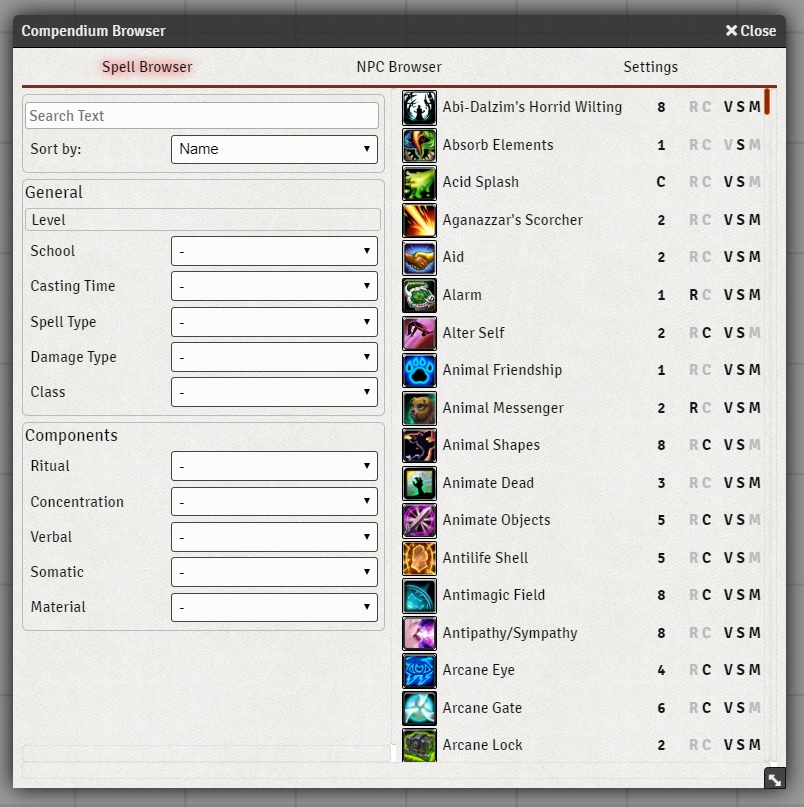

# Compendium Browser

> This version only works for Foundry v0.4.4 and up. To use the previous version please visit https://github.com/syl3r86/compendium-browser/tree/pre-0.4.4

A module to easily browse and filter spells as well as npcs loaded from compendie.

## Installation
1. Copy this link and use it in Foundrys Module Manager to install the Module

    > https://raw.githubusercontent.com/syl3r86/compendium-browser/master/module.json
    
2. Enable the Module in your Worlds Module Settings

## Details
Only the Gamemaster has access to the Settings, where they can enable or disable player access to the spell or npc-browser. It is **highly** recommended to disable any compendie that do not contain spell or should not be used in the NPC Browser. This reduces the initial loading time, that happens after a client connects to foundry, immensly.

This application enables anyone to add their own custom spell or npc filters via the api. After initialization the app can be found under game.compendiumBrowser where either addSpellFilter or addNpcFilter can be used to add a filter. This does support any data that the spell or npc has, including flags.

All filters featured in the app are included in this manor and can be found in the compendium-browser.js at around line 726.

## Contribution
If you feel like supporting my work, feel free to leave a tip at my paypal felix.mueller.86@web.de

## License
 Compendium Browser - a module for Foundry VTT - by <a xmlns:cc="http://creativecommons.org/ns#" href="https://github.com/syl3r86?tab=repositories" property="cc:attributionName" rel="cc:attributionURL">Felix Müller</a> is licensed under a <a rel="license" href="http://creativecommons.org/licenses/by/4.0/">Creative Commons Attribution 4.0 International License</a>.

This work is licensed under Foundry Virtual Tabletop [EULA - Limited License Agreement for module development v 0.1.6](http://foundryvtt.com/pages/license.html).
