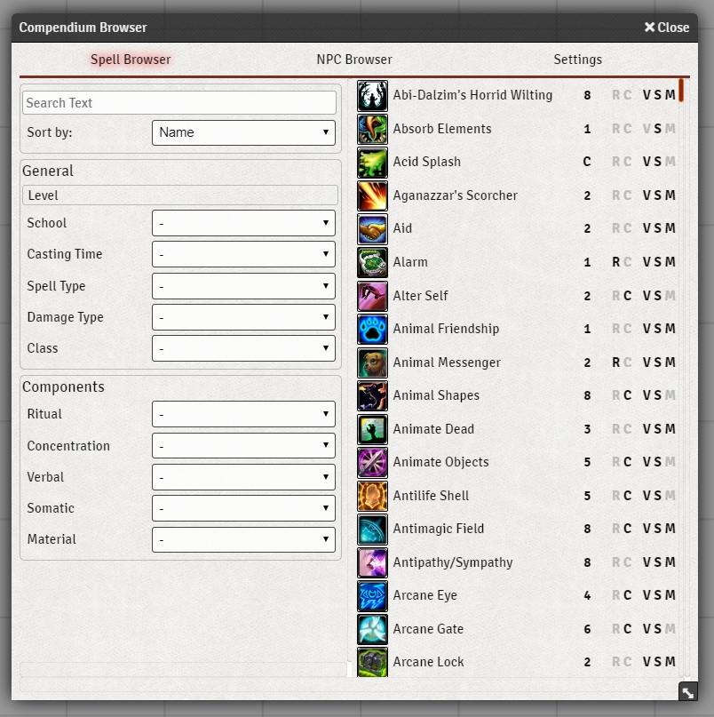

# Compendium Browser T20
Navegue e filtre magias, poderes, itens e Personagens de Mestre em compêndios.  

## License
 Compendium Browser - a module for Foundry VTT - by <a xmlns:cc="http://creativecommons.org/ns#" href="https://github.com/syl3r86?tab=repositories" property="cc:attributionName" rel="cc:attributionURL">Felix Müller</a> is licensed under a <a rel="license" href="http://creativecommons.org/licenses/by/4.0/">Creative Commons Attribution 4.0 International License</a>.

This work is licensed under Foundry Virtual Tabletop [EULA - Limited License Agreement for module development v 0.1.6](http://foundryvtt.com/pages/license.html).
